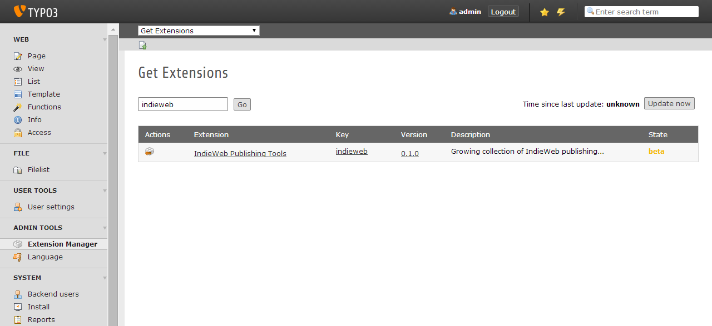
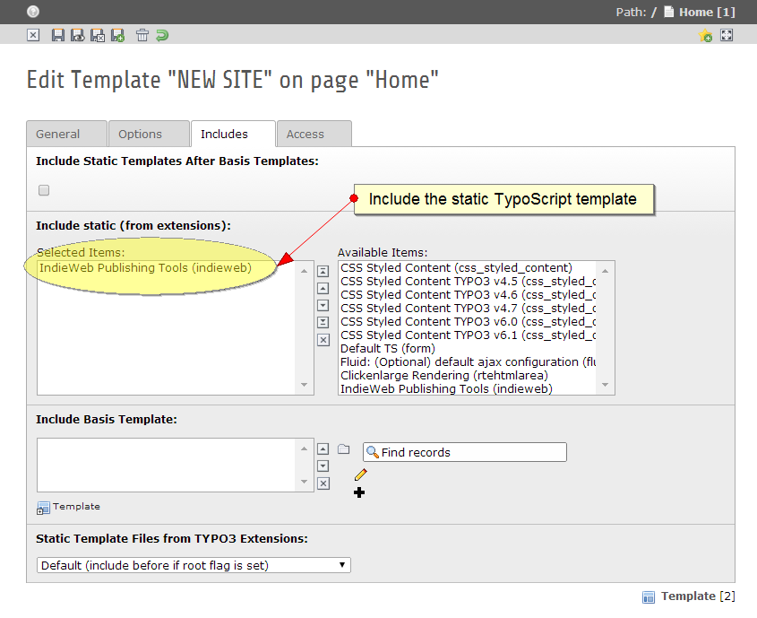

.. ==================================================
.. FOR YOUR INFORMATION
.. --------------------------------------------------
.. -*- coding: utf-8 -*- with BOM.

.. include:: ../Includes.txt

.. _admin-manual:

Administrator Manual
====================

Target group: **Administrators**

.. _admin-installation:

Extension installation
----------------------

Installing the *indieweb* extension is easy and straightforward. Perform the following steps:

1. Go to the Extension Manager (EM)
2. Select "**Get extensions**" from the function menu dropdown in the upper left corner, search for
   "**indieweb**" and install the extension by clicking on the "**Import and install**" icon to the left.
   

   Install the *indieweb* extension via the Extension Manager (EM)

.. _admin-typoscript:

Include the static TypoScript
-----------------------------

Include the plugin's static TypoScript into the root template of your site.

   Include the static TypoScript into your root template

.. _admin-features:

External dependencies
---------------------

Some of the extension's features require external packages. For example, the processing of `webmentions`_ 
require the `micrometa`_ parser for extracting author information out of referring remote documents. You
have to pull in the external dependencies with `Composer`_: On the command line, change to the extension's
root directory (where the `composer.json` file is located) and run:

.. code-block:: bash

   php composer.phar install

At some point in the future, the TYPO3 exension manager (EM) is supposed to support Composer
dependencies natively. Right now, however, this :ref:`doesn't seem to be very mature <known-problems>` yet. 

Enable specific features
------------------------

Most of the extension's features can be enabled and configured via the constant editor. Please see
the :ref:`configuration reference <configuration>` for further details.

.. _webmentions: http://indiewebcamp.com/Webmention
.. _micrometa: https://github.com/jkphl/micrometa
.. _Composer: https://getcomposer.org