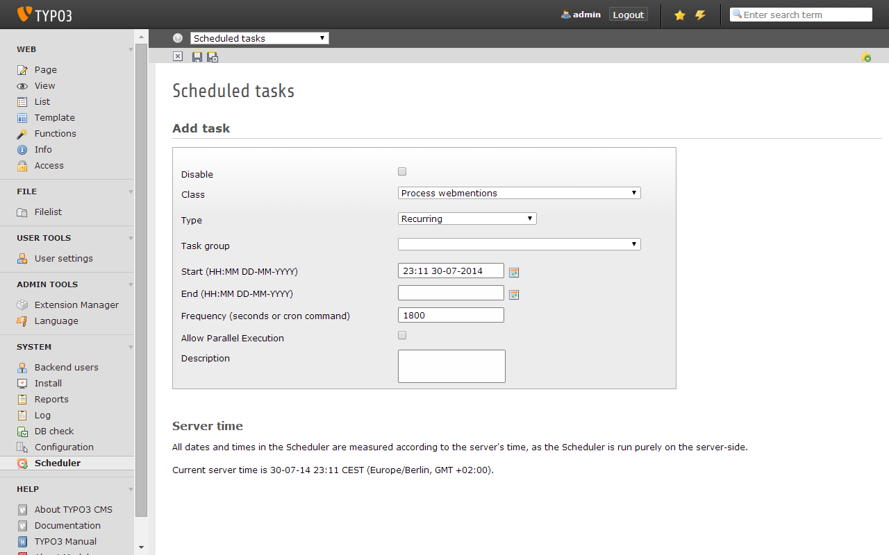

.. ==================================================
.. FOR YOUR INFORMATION
.. --------------------------------------------------
.. -*- coding: utf-8 -*- with BOM.

.. include:: ../Includes.txt

.. _configuration:

Configuration Reference
=======================

Target group: **Developers**

Most of the extension's features can be controlled via TypoScript constants. You may edit them using
the **constant editor**. The following sections list the constants grouped by feature.

.. only:: html

   .. contents::
      :local:
      :depth: 1

.. _configuration-general

General
-------

templateRootPath
^^^^^^^^^^^^^^^^

:typoscript:`plugin.tx_indieweb.view.templateRootPath =` :ref:`t3tsref:data-type-path`

Path to the Fluid template root directory (FE).

partialRootPath
^^^^^^^^^^^^^^^

:typoscript:`plugin.tx_indieweb.view.partialRootPath =` :ref:`t3tsref:data-type-path`

Path to the Fluid partial root directory (FE).

layoutRootPath
^^^^^^^^^^^^^^

:typoscript:`plugin.tx_indieweb.view.layoutRootPath =` :ref:`t3tsref:data-type-path`

Path to the Fluid layout root directory (FE).

storagePid
^^^^^^^^^^

:typoscript:`plugin.tx_indieweb.persistence.storagePid =` :ref:`t3tsref:data-type-posint`

ID of the default page used for storing records.

.. _configuration-webmentions:

Webmentions
-----------

By default, webmentions are accepted using the **page type 1500** and stored directly on the pages
which they are referring to. During webmention processing (either synchronously or asynchronously), the
notifying URL is requested, examined and the webmention gets verified. Information about the author
as well as a context excerpt will be extracted and stored along with the webmention record.

.. important::

   A webmention itself doesn't have any effect by default. You will need to implement a custom hook in
   order to further exploit a webmention and e.g. translate it into a blog post comment or something
   similar. It is completely up to you what you are doing with the webmentions you receive. Please see
   the :ref:`hooks section <developer-webmentions-hook>` for details.

webmentions
^^^^^^^^^^^

:typoscript:`plugin.tx_indieweb.features.webmentions =` :ref:`t3tsref:data-type-boolean`

Wheter to enable the receipt of webmentions. Enabling it will render a ``<link rel="webmention">``
meta tag to the source code of frontend pages.

webmentions.async
^^^^^^^^^^^^^^^^^

:typoscript:`plugin.tx_indieweb.settings.webmentions.async =` :ref:`t3tsref:data-type-boolean`

Wheter to process incoming webmentions asynchronously (e.g. in order to prevent DDoS attacks).
Requires the "Process webmentions" scheduler task to be enabled and running in case you opt for
asynchronous processing.

   Add and configure the "Process webmentions" scheduler task for asynchronous webmention processing 

webmentions.excerpt
^^^^^^^^^^^^^^^^^^^

:typoscript:`plugin.tx_indieweb.settings.webmentions.excerpt =` :ref:`t3tsref:data-type-posint`

Length of context excerpts extracted out of linking documents (number of characters). 

webmentions.regtype
^^^^^^^^^^^^^^^^^^^

:typoscript:`plugin.tx_indieweb.settings.webmentions.regtype =` :ref:`t3tsref:data-type-posint`

Page type for registering webmentions. Defaults to ``1500``. There should be no need to change
this except you have other extensions reserving this page type.

webmentions.infotype
^^^^^^^^^^^^^^^^^^^^

:typoscript:`plugin.tx_indieweb.settings.webmentions.infotype =` :ref:`t3tsref:data-type-posint`

Page type for requesting webmention relevant info from the pages your webmentions are referring to.
Defaults to ``1501``. There should be no need to change this except you have other extensions
reserving this page type.
